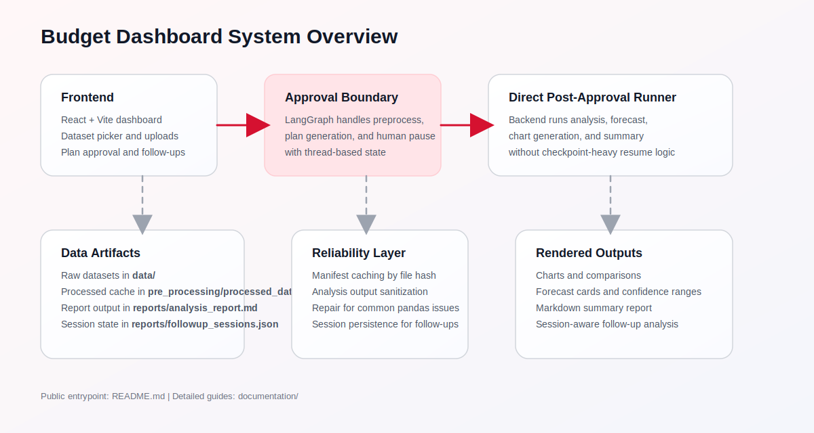
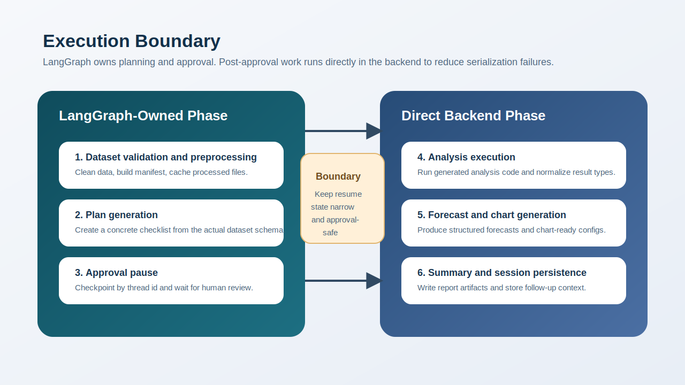

# Architecture

This document explains the current runtime architecture of the project as implemented now.

## Overview

The system is a multi-agent data analysis workflow with a React frontend and Flask backend.

The high-level runtime flow is:

`dataset selection/upload -> preprocess -> plan -> approval pause -> direct backend post-plan runner -> forecast -> chart generation -> summary`

## Why The Architecture Is Split

The system does not keep the full analysis lifecycle inside LangGraph anymore.

Why:

- the approval pause maps well to graph checkpointing
- the post-approval steps work better as direct backend execution because LLM/tool outputs often include values that are awkward to serialize safely
- this split preserves the useful human-in-the-loop checkpoint without forcing every downstream runtime artifact through the same persistence boundary

In practice, that means:

- LangGraph owns planning and approval interruption
- Flask owns the heavier post-approval execution path

That split is one of the main reliability decisions in the current codebase.

## Backend Execution Model

### Start Phase

`POST /api/analyze/start` handles:

1. dataset validation and path resolution
2. preprocessing
3. plan generation
4. approval pause

This phase still uses LangGraph because the approval interrupt is a natural fit for checkpointed graph execution.

Outputs from this phase should stay narrow and approval-safe: identifiers, schema context, plan data, and the minimum state needed to resume.

## Post-Approval Execution Model

After approval, the backend does not continue the full LangGraph execution path.

Instead, it runs the remaining nodes directly in Python:

- analysis
- forecast generation
- graph generation
- summary generation

This change reduces fragility around serialized state and checkpointing, especially when Pandas or NumPy values appear in LLM/tool outputs.

In practical terms, this is what prevents the system from repeatedly failing on resume when generated analysis returns values that are valid in Python but awkward in checkpoint serialization.

## Main Subsystems

### Preprocessing

Code:

- `pre_processing/processing_agent.py`
- `pre_processing/tools.py`

Responsibilities:

- load raw CSV/JSON input
- generate cleaning/transformation code
- write cleaned JSON output
- produce a manifest with columns, dtypes, row count, and summary
- cache results by file hash

Outputs:

- cleaned dataset under `pre_processing/processed_data/`
- manifest under `pre_processing/processed_data/`

### Planner

Code:

- `plannerAgent/planner_agent.py`

Responsibilities:

- inspect manifest/schema context
- produce a structured checklist of analysis steps
- keep steps concrete and aligned to actual columns

Output:

- plan object with ordered `analyses`

### Analysis Agent

Code:

- `agent_tools/agent.py`
- `agent_tools/analyzer.py`

Responsibilities:

- generate pandas analysis code
- execute generated code
- parse structured JSON output
- normalize runtime values into safe Python types

Output:

- structured analysis result dict

### Forecasting

Code:

- `forecastAgent/forecast_agent.py`
- `forecastAgent/tools.py`

Responsibilities:

- detect timeseries analysis outputs
- generate forecast projections
- include confidence bounds, trend direction, model type, and R²

Output:

- `forecast_output` object with `forecasts`

### Graph Generation

Code:

- `graphAgent/graphAgent.py`
- `graphAgent/tools.py`

Responsibilities:

- convert structured analysis outputs into ApexCharts-compatible chart configs
- choose chart types based on output type
- avoid duplicate charts for follow-up flows

Output:

- `graph_data` object with `charts`

### Summarization

Code:

- `summarizerAgent/summarizer_agent.py`
- `summarizerAgent/tools.py`

Responsibilities:

- generate the markdown report from structured analysis + forecast output
- write the latest report to `reports/analysis_report.md`

Output:

- markdown summary string
- report file on disk

### Frontend

Primary files:

- `frontend/src/App.jsx`
- `frontend/src/App.css`

Responsibilities:

- fetch datasets
- upload files/folders
- submit questions
- display plan approval UI
- render charts and forecasts
- store conversation state locally
- send follow-up questions against a backend session

## Data Flow and Artifacts

### Raw Inputs

- user-uploaded or preloaded files under `data/`

### Processed Outputs

- cleaned JSON datasets under `pre_processing/processed_data/`
- per-file manifests under `pre_processing/processed_data/`

### Runtime Outputs

- analysis result dict in backend memory during request execution
- forecast output object
- chart registry/configs
- markdown report in `reports/analysis_report.md`
- follow-up session state in `reports/followup_sessions.json`

## Session and Persistence Model

### Approval Pause

The approval pause still relies on LangGraph `MemorySaver`, keyed by `thread_id`.

### Follow-Up Sessions

Follow-up state is persisted separately in:

- `reports/followup_sessions.json`

This file stores:

- manifest/manifests
- original data path(s)
- canonical dataset identity when available
- short conversation history
- chart IDs already shown on the dashboard

That allows follow-up questions to survive backend restarts better than purely in-memory session state, and it gives the frontend a deterministic way to recover dataset identity for older saved chats.

## Reliability Boundaries

### Generated Code Execution

The system executes LLM-generated Python. That is inherently less predictable than fully hand-authored logic.

Current reliability measures include:

- preprocessing and analysis prompt constraints
- structured output requirements
- runtime sanitization of Pandas/NumPy-backed values
- targeted fixes for known pandas deprecations

### Serialization Safety

`pipeline/state.py` normalizes:

- NumPy scalars and arrays
- Pandas timestamps, periods, timedeltas
- Pandas `Series`, `Index`, and `DataFrame`
- NaN and infinity values

This reduces failures when passing data between tools, nodes, or persistence boundaries.

### Operational Reliability

The current design improves reliability in three distinct places:

- before analysis: preprocessing and manifest generation reduce schema ambiguity
- during analysis: execution wrappers enforce JSON-shaped outputs and normalize runtime values
- after analysis: charting, forecasting, and summary generation consume structured data instead of raw model prose

This is still a generated-analysis system, so "more reliable" means "more resilient to common runtime failures," not "fully deterministic."

### Retry/Repair Behavior

The system already includes runtime guards for common generated-analysis failures, but analysis remains prompt-sensitive and non-deterministic.

## Current Boundary To Keep In Mind

The architecture is no longer the older “everything resumes inside LangGraph through summarization” model.

The current behavior is:

- LangGraph for preprocess/plan/approval interrupt
- direct backend execution for post-approval work

Any future documentation or code changes should preserve that distinction unless the execution model is intentionally redesigned.

## Reviewer Checklist

When reviewing architecture-impacting changes, verify:

1. approval still pauses cleanly before generated analysis runs
2. resume still uses the direct backend post-plan path
3. persisted state does not store raw NumPy or pandas objects
4. follow-up requests still reuse session context without reintroducing the old serialization failure class
