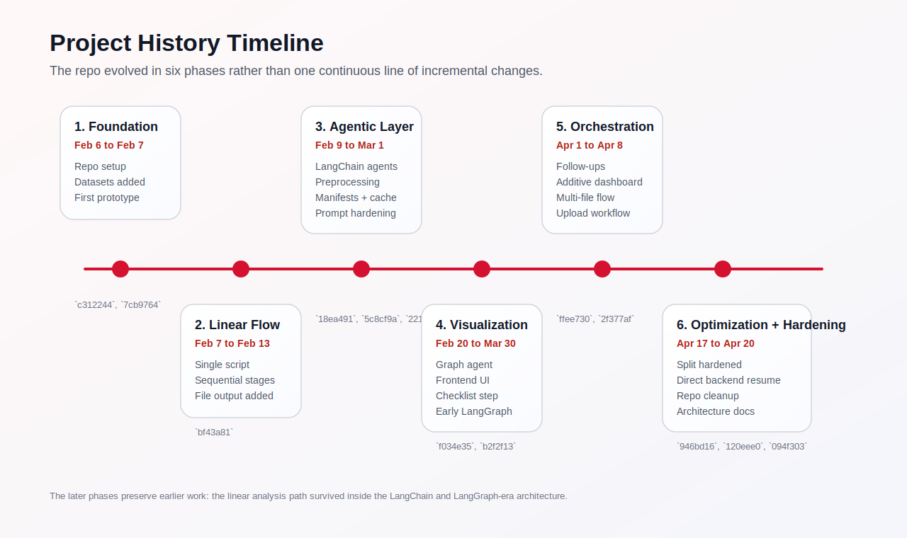
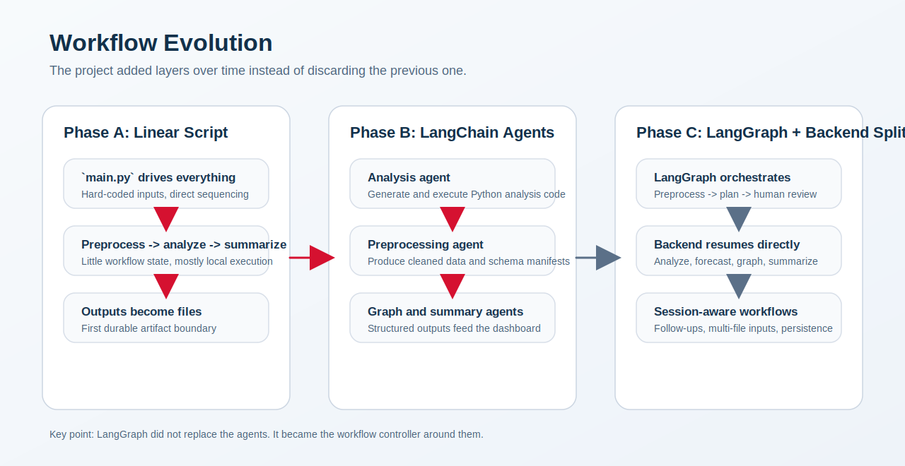
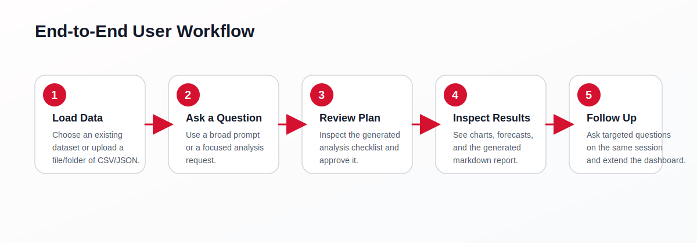

# Project History

This document explains how the project evolved from an early single-script prototype into the current multi-agent analysis platform. It is based on the local `git` history, the current codebase, and the architecture documents in this repo.

## At A Glance

The broad evolution of the repo is:

1. project foundation and setup
2. linear pipeline development
3. agentic framework implementation
4. visualization, frontend, and interaction layer
5. orchestration and workflow evolution
6. system optimization and hardening

That is slightly more detailed than the original five-part framing because the commit history shows a distinct orchestration phase between "agentic framework" and "optimization". The move into planning, approval, follow-ups, multi-file flows, and later the hardened LangGraph/backend split changed the execution model, not just the performance or polish of the app.

## 1. Project Foundation And Setup

**Approximate window:** February 6 to February 7, 2026

**Representative commits**

- `c312244` - `first commit`
- `e1a7813` - `folders`
- `7cb9764` - `prototype`

The project started as a lightweight exploration repo centered on local data analysis. The early structure established the first dataset assets, a `main.py` entrypoint, and supporting folders for retrieval and analysis code. The emphasis was not yet on a reusable application boundary. It was on proving that a dataset could be loaded, inspected, and summarized from Python.

The `prototype` commit shows that this first phase still carried notebook-era artifacts, raw dataset snapshots, and simple analyzer/summarizer modules. That is a useful signal about the original goal: get an end-to-end proof of concept working first, then clean up architecture later.

What this phase contributed:

- a working repository shape
- initial dataset packaging under `data/`
- a simple analysis-oriented Python flow
- enough scaffolding to begin replacing deterministic code paths with LLM-driven behavior

## 2. Linear Pipeline Development

**Approximate window:** February 7 to February 13, 2026

**Representative commits**

- `7cb9764` - `prototype`
- `0eff092` - `progress`
- `114b255` - `cleaning codebase`
- `bf43a81` - `ouptut to file feature`

Before the project became agentic, it behaved much more like a linear script. The current `main.py` still reflects that heritage: preprocess, plan, analyze, graph, summarize, all in one direct control path with hard-coded inputs and no user-facing orchestration boundary.

In this stage, the system was closer to "run a question against a dataset and print or save outputs" than to "host a multi-step interactive analysis experience". The work on output-to-file behavior is especially important because it introduced the idea that generated results were artifacts to preserve, not only console output to inspect manually.

This phase matters because it established the base sequence that later survived in more sophisticated forms:

- ingest data
- transform or prepare it
- analyze it
- generate human-readable output

Even after the architecture changed, the repo kept this basic analytical spine.

## 3. Agentic Framework Implementation

**Approximate window:** February 9 to March 1, 2026

**Representative commits**

- `ad6536c` - `adding agent`
- `6a07557` - `added agent code`
- `18ea491` - `starter code for langchain agent`
- `22fdd6f` - `agent working but needs checks`
- `5c8cf9a` - `added preprocessing`
- `221a44a` - `cached cleaned data`
- `ddaf425` - `prompt engineering: few-shot + system prompt improvements across all agents`

This was the first major architectural shift. The project moved from a mostly direct Python workflow into a LangChain-based agent model. Instead of hand-writing every analysis branch, the repo began generating code, executing it, and interpreting results through agent/tool contracts.

Two sub-transitions happened inside this phase.

First, analysis became agent-driven. The early `agent_tools/` work introduced the model-and-tool loop that still anchors the backend: prompt an LLM, generate Python analysis code, execute it, and extract structured output.

Second, preprocessing became its own agentic subsystem. The `added preprocessing` and later caching work turned data cleaning from an implicit prep step into a named stage with artifacts:

- cleaned dataset outputs
- schema manifests
- deterministic processed-data paths
- file-hash cache reuse

That was an important maturation point. Once preprocessing produced manifests, later planner, graph, and follow-up logic could reason about the dataset through a stable intermediate contract instead of rediscovering schema details every time.

This phase also shows the repo learning how to live with generated code in production-like flows. Prompt engineering improvements and validation checks were not cosmetic. They were part of making the agent loop reliable enough to support a full application.

## 4. Visualization, Frontend, And Interaction Layer

**Approximate window:** February 20 to March 30, 2026

**Representative commits**

- `f034e35` - `graph agent + frontend structure`
- `a77f702` - `baseline frontend`
- `2f438de` - `frontend almost connected to backend`
- `76ef6ee` - `frontend prototype`
- `53a3850` - `fixed graph generation error`
- `b2f2f13` - `checklist generation step`
- `61079df` - `graph + frontend improvement`
- `225f0fb` - `fixed output of agent to graph`
- `8be4d69` - `frontend + graph gen improvements`
- `212f7e2` - `future outlook section`
- `a96d38b` - `fixed graph population error`

Once the core agent loops existed, the project expanded from a backend experiment into a dashboard-style product. This phase introduced two durable ideas.

The first was that analysis results should be visualized, not just summarized. Graph generation became a first-class subsystem, eventually landing in `graphAgent/` with chart-oriented outputs that could be rendered by the frontend.

The second was that the user experience needed structure around the analysis itself. The frontend was not just a wrapper around an API call. Over several commits it became a place to:

- submit questions
- receive graph-ready outputs
- surface future-looking forecast content
- interact with the system as a workflow rather than a script

The checklist generation step is especially notable in hindsight. It was an early sign that the project wanted more explicit planning and controllability before code execution. That later became part of the LangGraph-era approval model.

This phase also included repeated stabilization loops around graph population and the handoff between analysis outputs and chart generation. Those fixes were foundational because the entire dashboard experience depended on structured intermediate outputs instead of loosely formatted LLM text.

This phase also contains the first visible LangGraph-based orchestration layer. `pipeline/graph.py` first appears on February 25, 2026, which means the repo had already started managing preprocess, plan, approval, and resume behavior with a graph before the final architecture was hardened in mid-April.

For the current runtime view of these layers, see the existing visuals:

## 5. Orchestration And Workflow Evolution

**Approximate window:** April 1 to April 8, 2026

**Representative commits**

- `ffee730` - `Add follow-up questions feature with additive dashboard`
- `2f377af` - `Add multi-file pipeline support with per-file preprocessing`
- `2edc290` - `ui redesign + bug fixes + upload multiple files`

This phase changed the nature of the application. Up to this point, the repo had increasingly capable agents and a growing UI, but the workflow was still relatively single-pass. Early April introduced richer statefulness and a more product-like interaction model.

The follow-up feature changed the system from one-shot analysis into session-based analysis. Instead of replacing prior outputs, the dashboard became additive, allowing new questions to build on prior context and charts.

Multi-file support was an equally important change. The app no longer assumed a single dataset file as the unit of analysis. The pipeline began to preprocess each file independently and carry a set of manifests forward. That is one of the clearest signs that the repo was moving from demo behavior to general-purpose workflow handling.

This phase also improved dataset upload behavior and UI organization, which tightened the connection between backend capabilities and user-facing affordances. The frontend stopped being just a display layer and became part of how the data-analysis workflow was configured and managed.

## 6. System Optimization And Hardening

**Approximate window:** April 17 to April 20, 2026

**Representative commits**

- `31307a4` - `requirments.txt + cleaned repo`
- `946bd16` - `Clean repo and harden analysis pipeline`
- `686e76c` - `bug fix`
- `120eee0` - `docs`
- `094f303` - `Update app, docs, and dataset metadata`

The final visible phase in the current history is less about adding a new headline feature and more about stabilizing the architecture that had emerged.

This is where the current execution split became explicit and better documented:

- LangGraph handles the approval-safe part of the flow
- the backend directly runs the heavier post-approval execution path

That split is documented in the current architecture docs and implemented in `pipeline/graph.py` and `backend.py`. The reason is practical rather than ideological: the project needed a human approval boundary and resumable state, but it also needed to avoid fragile checkpoint serialization for larger, more dynamic post-analysis artifacts.

So the most accurate reading of the history is:

- LangGraph orchestration entered the repo in late February
- follow-up and multi-file work in early April expanded the workflow model around it
- the April hardening phase clarified the boundary where LangGraph should stop and direct backend execution should take over

The hardening work in this period also included:

- repo cleanup and removal of development debris
- explicit architecture and troubleshooting documentation
- safer state sanitization
- clearer runtime boundaries
- better dataset/session metadata handling

The current approval boundary is summarized here:

## The LangChain To LangGraph Transition

The history supports the interpretation you gave, but with an important nuance.

The project did not move from a linear workflow to LangChain agents and then fully replace that with LangGraph. Instead:

- the repo first evolved from direct script execution into LangChain-powered agents
- those LangChain agents remained responsible for task work such as preprocessing, analysis, graph generation, and summarization
- LangGraph was later added as the orchestration layer for planning, approval interruption, and controlled resume behavior

In other words, LangGraph did not replace the agentic layer. It wrapped and coordinated it.

That is why the current architecture still contains both:

- LangChain agents for generating and executing task-specific behavior
- LangGraph for `preprocess -> plan -> human_review` orchestration

## Current Architecture Outcome

By the current `main` branch, the project has landed on a hybrid architecture:

- Flask provides the application API surface
- LangChain agents perform preprocessing, analysis, chart generation, forecasting support, and summarization tasks
- LangGraph owns the planning and approval checkpoint boundary
- the backend executes post-approval analysis directly in Python for reliability
- the frontend supports uploads, plan review, charts, forecasts, follow-ups, and saved session context

The important historical pattern is that every major phase kept a piece of the previous one:

- the linear analytical sequence survived inside later orchestrated flows
- the LangChain agent model survived after LangGraph was introduced
- the visualization work survived into the final dashboard
- the later hardening work preserved flexibility while narrowing the fragile execution boundaries

## Recurring Themes Across The History

- **From implicit to explicit structure.** The repo moved from loosely connected scripts toward manifests, plans, graph configs, reports, and persisted sessions.
- **From one-shot runs to interactive workflows.** The addition of planning, approval, follow-ups, and multi-file support turned the app into a stateful user workflow.
- **From experimentation to reliability.** Caching, state sanitization, artifact boundaries, and documentation became necessary once generated code moved beyond prototype usage.
- **From single-layer intelligence to layered control.** The project now separates task intelligence from workflow control, with LangChain and LangGraph serving different purposes.

## Commit Milestones Referenced

| Date | Commit | Why it matters |
| --- | --- | --- |
| 2026-02-06 | `c312244` | First repo commit and public starting point |
| 2026-02-07 | `7cb9764` | First working prototype |
| 2026-02-10 | `18ea491` | Clear LangChain agent introduction |
| 2026-02-20 | `5c8cf9a` | Preprocessing added as a named subsystem |
| 2026-02-20 | `f034e35` | Graph agent and frontend structure introduced |
| 2026-02-24 | `b2f2f13` | Checklist generation introduced explicit planning |
| 2026-02-28 | `221a44a` | Processed-data caching improved repeatability |
| 2026-03-01 | `ddaf425` | Prompt/system improvements across agents |
| 2026-04-01 | `ffee730` | Follow-up workflow and additive dashboard |
| 2026-04-08 | `2f377af` | Multi-file pipeline support |
| 2026-04-17 | `946bd16` | Pipeline hardening and current reliability direction |
| 2026-04-20 | `094f303` | Current documentation, visuals, and dataset metadata pass |
